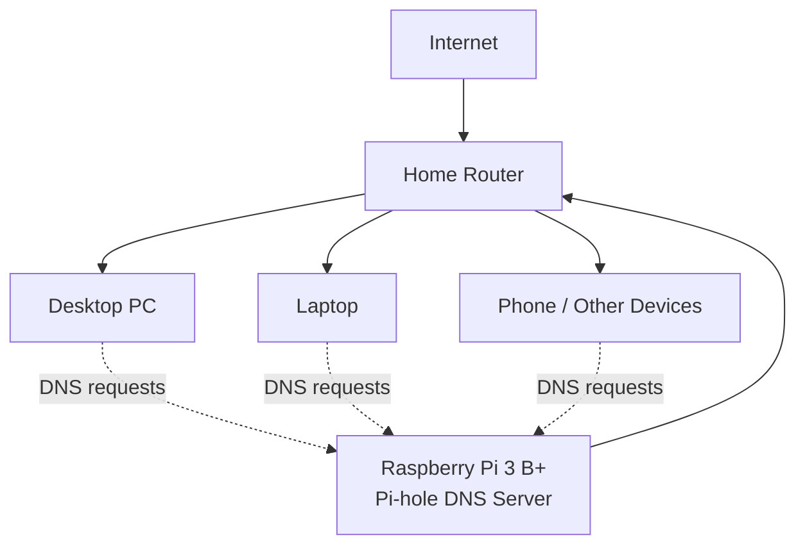

## Network Diagram

```mermaid
flowchart TD
    Internet[Internet]
    Router[Home Router]
    PiHole[Raspberry Pi 3 B+<br/>Pi-hole DNS Server]
    Desktop[Desktop PC]
    Laptop[Laptop]
    Phone[Phone / Other Devices]

    Internet --> Router
    Router --> Desktop
    Router --> Laptop
    Router --> Phone

    Desktop -. DNS requests .-> PiHole
    Laptop -. DNS requests .-> PiHole
    Phone -. DNS requests .-> PiHole
    PiHole --> Router
```