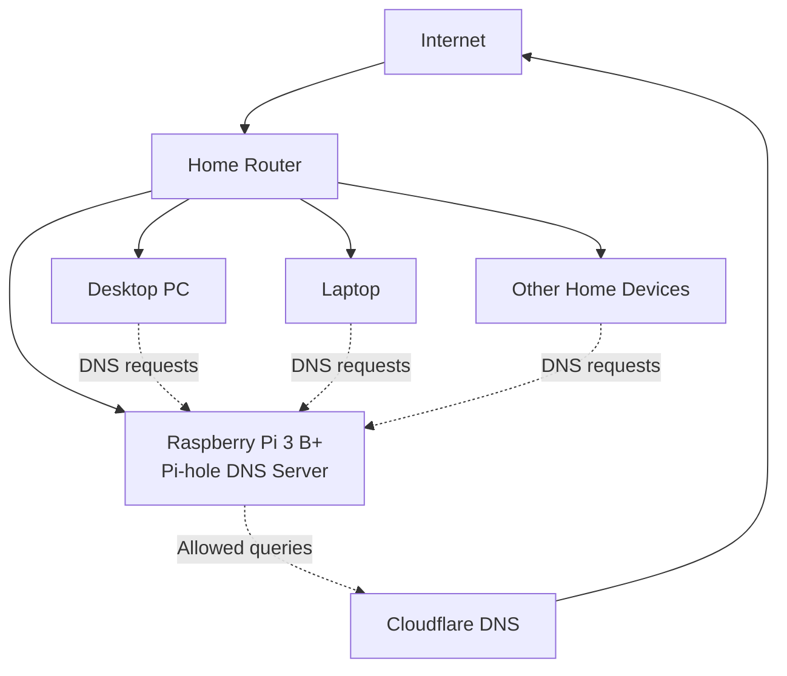
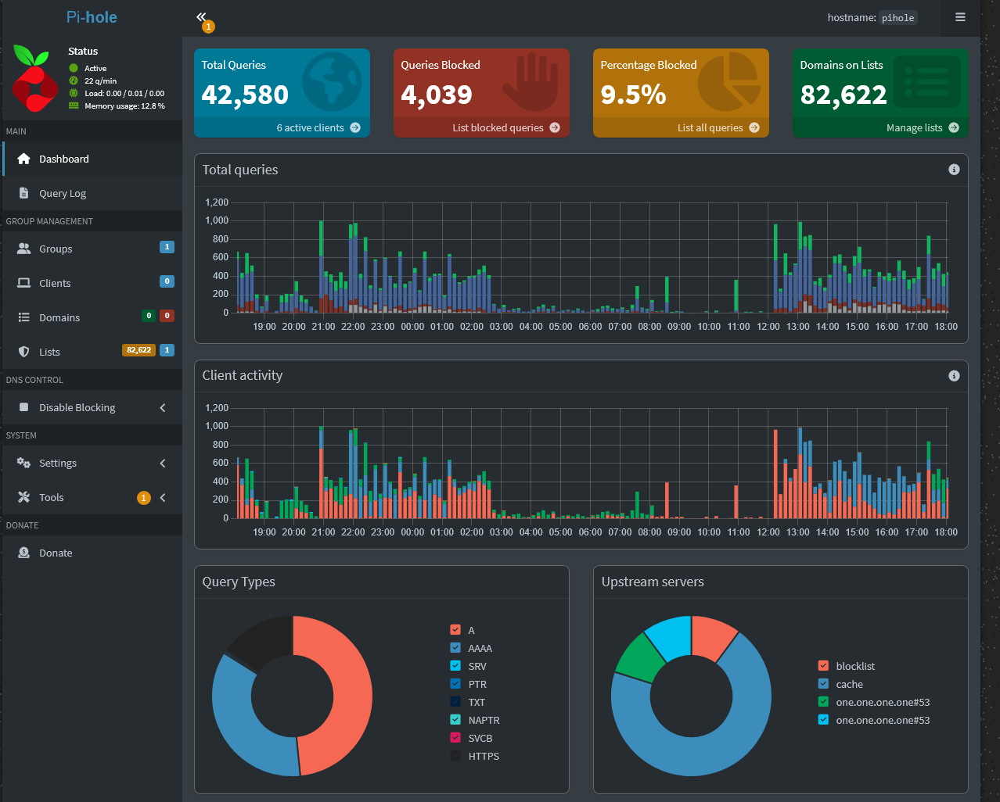
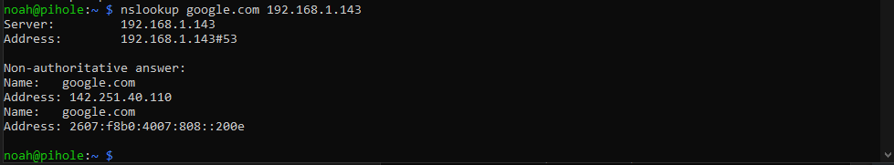
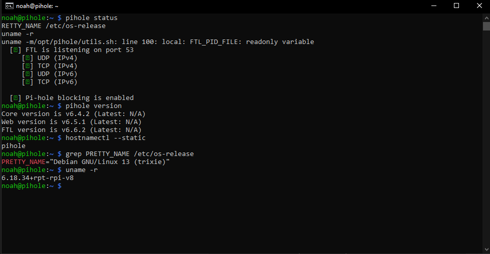

# Pi-hole DNS Filtering Home Lab

## Project Overview

I deployed Pi-hole on a Raspberry Pi 3 B+ to provide network-level DNS filtering for devices on my home network.

This project gave me hands-on experience with Linux administration, DNS configuration, static IP addressing, SSH, IPv4/IPv6, client testing, dashboard monitoring, and network troubleshooting.

## Technologies Used

- Raspberry Pi 3 B+
- Raspberry Pi OS / Debian Linux
- Pi-hole
- DNS
- IPv4 and IPv6
- SSH
- Windows PowerShell
- Cloudflare DNS

## Network Diagram



## Implementation

1. Installed and configured Pi-hole on a Raspberry Pi 3 B+.
2. Configured the Raspberry Pi with a consistent private IP address.
3. Enabled SSH for remote Linux administration.
4. Configured client devices to send DNS requests through Pi-hole.
5. Verified IPv4 and IPv6 DNS functionality.
6. Reviewed dashboard statistics and query activity.
7. Confirmed that blocked domains were filtered while permitted domains continued to resolve.

## Validation

I verified that Pi-hole was operating correctly using:

```bash
pihole status
pihole version
```

I also tested DNS resolution with:

```bash
nslookup google.com 192.168.1.143
```

The Pi-hole server responded on DNS port 53 and successfully returned IPv4 and IPv6 records.

## Screenshots

### Pi-hole Dashboard

The dashboard confirms that multiple clients are sending DNS traffic through Pi-hole and that blocked requests are being filtered.



### DNS Resolution Test

The Pi-hole server successfully answered a DNS query on port 53 and returned both IPv4 and IPv6 records.



### Service and System Information

The command-line output confirms that Pi-hole blocking is enabled and displays the installed Pi-hole and operating-system versions.



## Skills Demonstrated

- DNS configuration and troubleshooting
- Linux command-line administration
- SSH remote administration
- Static IP configuration
- IPv4 and IPv6 networking
- Client DNS testing
- Dashboard and query-log analysis
- Technical documentation

## Troubleshooting

During testing, I verified each part of the DNS path individually:

1. Confirmed that the Raspberry Pi was reachable.
2. Confirmed that Pi-hole services were running.
3. Checked that Pi-hole was listening on port 53.
4. Sent a direct DNS query to the Pi-hole server.
5. Confirmed that the request appeared in the dashboard.
6. Verified that both IPv4 and IPv6 records were returned.

## What I Learned

This project helped me better understand how DNS requests move between client devices, a local DNS server, and an upstream provider.

I also learned how to distinguish DNS problems from general network-connectivity problems by testing the client configuration, server availability, service status, port availability, and DNS resolution separately.

## Security and Privacy

Screenshots in this repository have been sanitized to remove passwords, public IP addresses, MAC addresses, personal hostnames, and unnecessary client activity.
